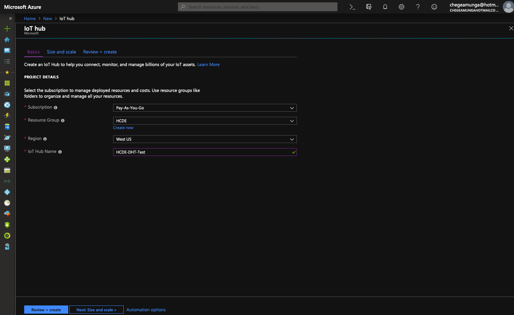
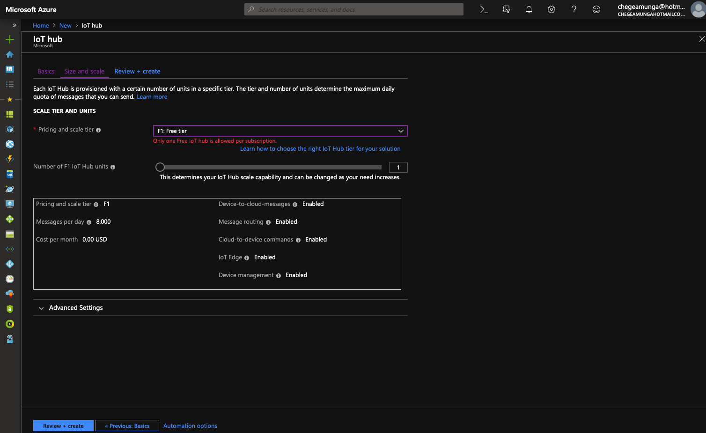
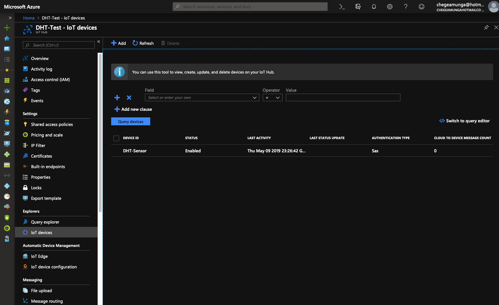
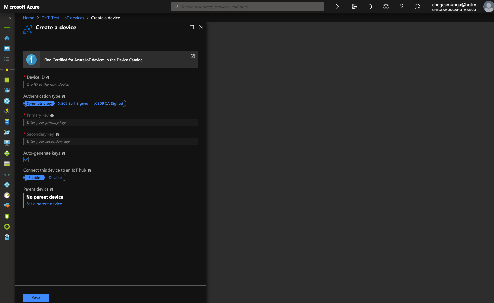
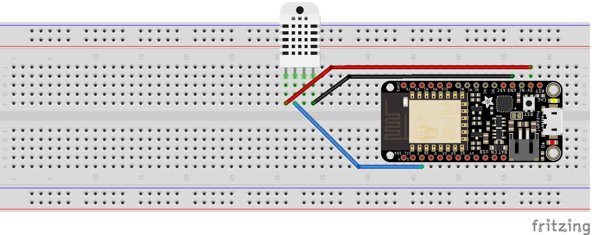
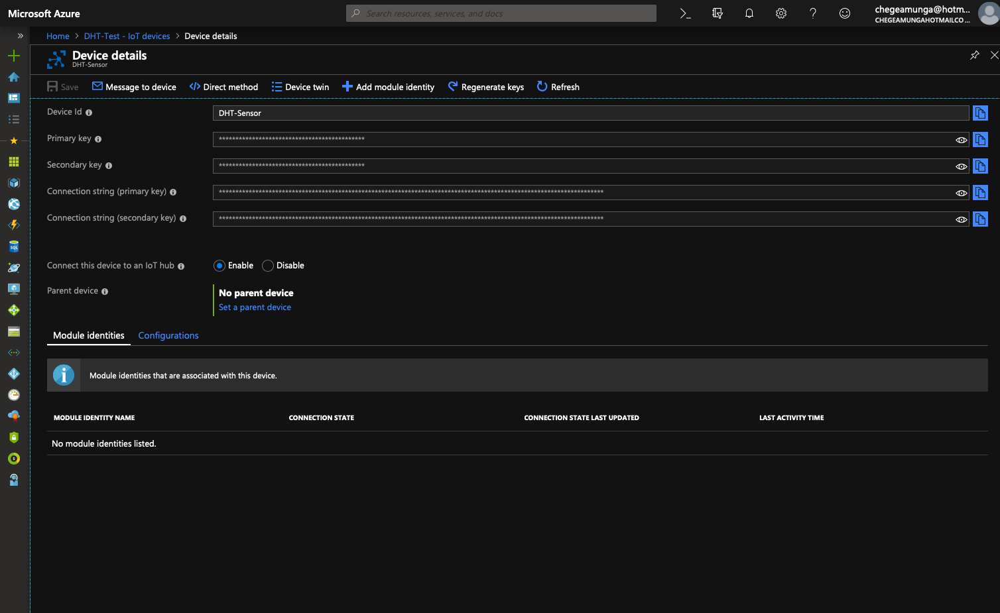
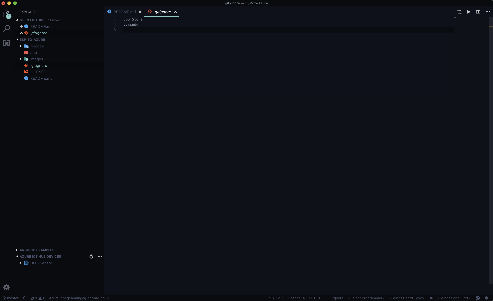

# IoT Hub Feather HUZZAH Client application 

> This repo contains the source code to help you get familiar with Azure IoT using the Azure IoT Adafruit Feather HUZZAH ESP8266 Starter Kit. You will find the [lesson-based tutorials on Azure.com](https://docs.microsoft.com/en-us/azure/iot-hub/iot-hub-arduino-huzzah-esp8266-get-started) and [here](https://docs.microsoft.com/en-us/azure/iot-hub/iot-hub-vscode-iot-toolkit-cloud-device-messaging). 

This repo contains an arduino application that runs on board feather HUZZAH ESP8266 with a DHT22 temperature & humidity sensor, and then sends these data to your IoT hub. 

### Terminology
1. VS Code = Visual Studio Code
2. D2C message = Device-to-cloud message
3. C2D message = Cloud-to-device message

## Things needed
1. Feather HUZZAH ESP8266 board
2. Active Azure subscription. For professors and students you can get a longer free trial through [GitHub Education](https://education.github.com/pack) or [Azure for Education](https://azure.microsoft.com/en-us/free/students/).
3. [VS Code IDE](https://code.visualstudio.com)
4. [Arduino IDE](https://www.arduino.cc/en/Main/Software)

## Create your Azure IoT hub
Section describes how to create an IoT hub using the [Azure Portal](https://portal.azure.com/)
1. Choose `+Create a resource`, then click on `Internet of Things`. Select `IoT Hub`

2. Click on `Review + create` then click on `Create` to create your new IoT hub. Creating the hub takes a few minutes

## Register a new device in the IoT hub
1. In the IoT hub navigation menu, click on `IoT devies` then click on `Add` to register a new device

2. Name the device in the `Device ID` field

3. Click `Save`

## Install board with your Arduino IDE 
1. Start Arduino and open Preferences window.
2. Enter `http://arduino.esp8266.com/stable/package_esp8266com_index.json` into Additional Board Manager URLs field. You can add multiple URLs, separating them with commas.
3. Open Boards Manager from `Tools > Board` menu and install `esp8266 by ESP8266 Community version 2.4.2`
> WARNING: You will experience compiling issues if you install version 2.5.0 (the latest version)
4. Select your ESP8266 board from `Tools > Board` menu after installation

## Install libraries
Install the following libraries from `Sketch -> Include library -> Manage libraries`

* `AzureIoTHub by Adafruit version 1.0.45`
* `AzureIoTUtility by Adafruit version 1.0.45`
* `AzureIoTProtocol_MQTT by Adafruit version 1.0.45`
* `ArduinoJson by Beniot Blanchon version 5.13.5`
> WARNING: You will experience compiling issues if you install version 6.10.1 (the latest version) 
* `DHT sensor library by Adafruit version 1.3.4`
* `Adafruit Unified Sensor by Adafruit version 1.0.3`

## Connect your sensor with your board
### Connect with a physical DHT22 sensor
You can follow the image to connect your DHT22 with your feather HUZZAH ESP8266.

### DON'T HAVE A PHYSICAL DHT22?
You can use the application to simulate temperature & humidity data and send to your IoT hub.
1. Open the `app/config.h` file.
2. Change the `SIMULATED_DATA` value from `false` to `true`.

## Configure Credentials
1. Open the `app/config.h` file
2. Edit `WIFI_SSID`
3. Edit `WIFI_PASS`
4. Back at the Azure Portal, click on `IoT devices` then the new device created. Copy the `connection string (primary key)` and proceed to step 5

5. Edit `CONNECTION_STRING`

## Configure and run sample application
1. Upload the `app.ino` to your board.
2. Open `serial monitor` to view sent message
3. In Azure Portal, click on `Overview` which can be found in the navigation menu
> Unfortunately: to view messages sent to Azure in the portal, we would have to pay for Azure Events Hub (still working on this to find a method to view message on the portal and connect to other applications like Slack, email etc.) Here is a workaround to view the JSON sent to Azure.

## Using VS Code to view sent JSON message
1. Open VS Code 
2. Click on `Extensions`
3. Search for and install `Arduino`
4. Search for and install `Azure IoT Tools`
5. Click on `Explorer`
6. At the bottom right, click on `Azure IoT Hub Devices`

7. Right-click your device and select `Start Monitoring D2C Message`
8. The monitored messages will be shown in `OUTPUT > Azure IoT Hub Toolkit view`
9. To stop monitoring, right-click the `OUTPUT` view and select `Stop Monitoring D2C Message`

# You did it!!!